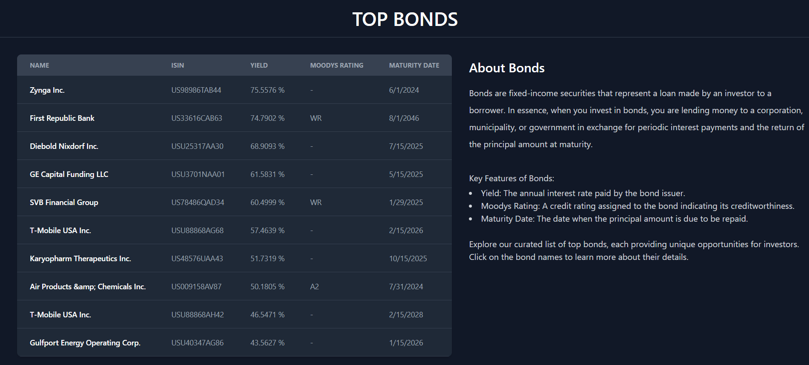
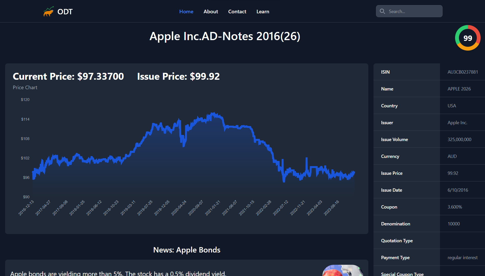

# ODT
Modern Bonds Search Engine.

Options and derivative terminal | Modern Bonds Search Engine.
(Just Bonds for now)

This is a web scraping project that provides detail about just bonds for now.

## Home Page ✨

Yes, that's the image from [Notion](https://www.notion.so/) 🤫

## Features ✨

- Bonds
- News
- Dynamic Content (Web scraping)
- Live Contact Page
- Dark mode
- Fullscreen mode
- Cross platform

## Top Bonds (Home Page) ✨

## Top news directly from GNews (Home Page) ✨

## Search Page ✨

Search Result with term: Apple

## Dashboard ✨

Displaying price chart of Apple 2026 Bond,moody's rating, with useful information on right side and displaying related news under the graph.  

## Websites Scraped ✨

- https://markets.businessinsider.com/
- https://news.google.com/

## Author ✨

- [@sakshamssr](https://github.com/sakshamssr)
